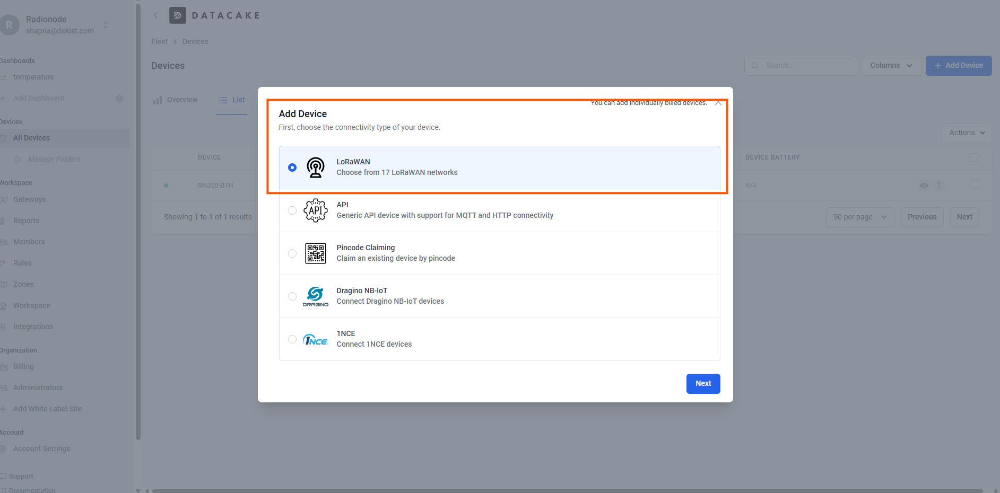
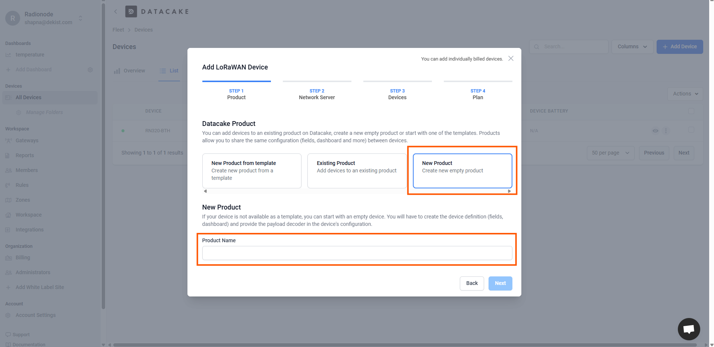
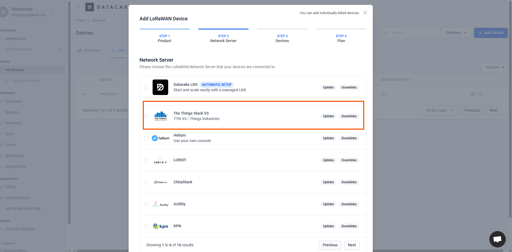
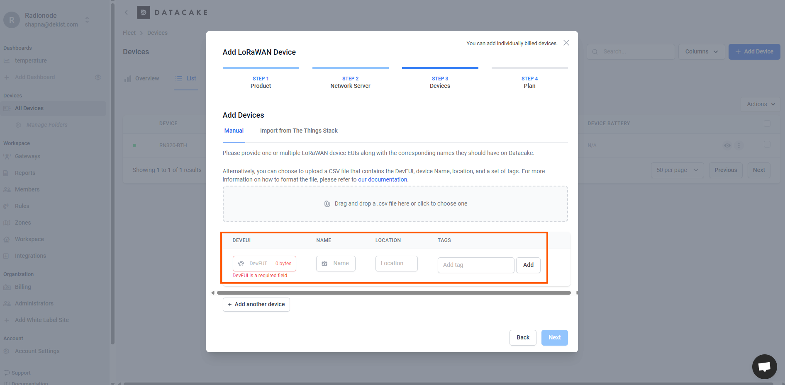
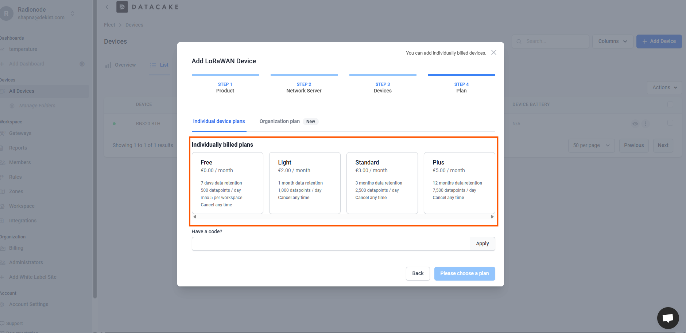
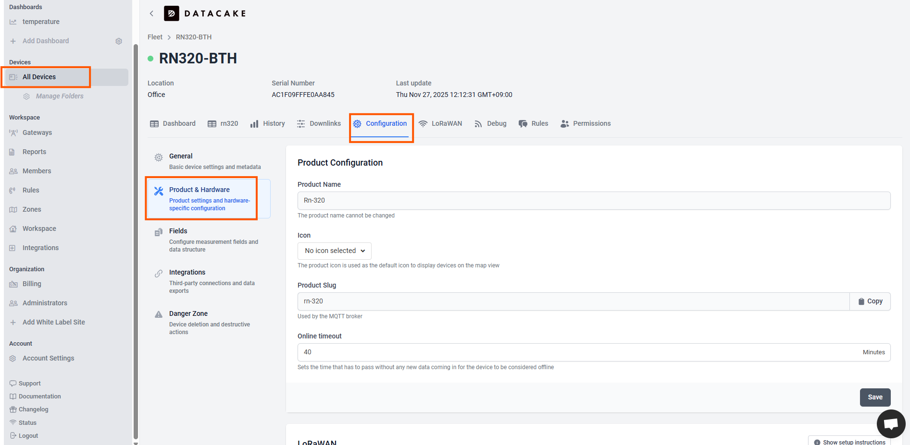
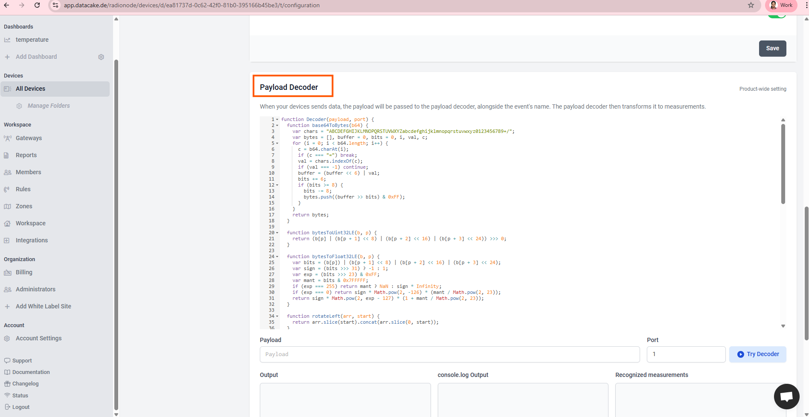
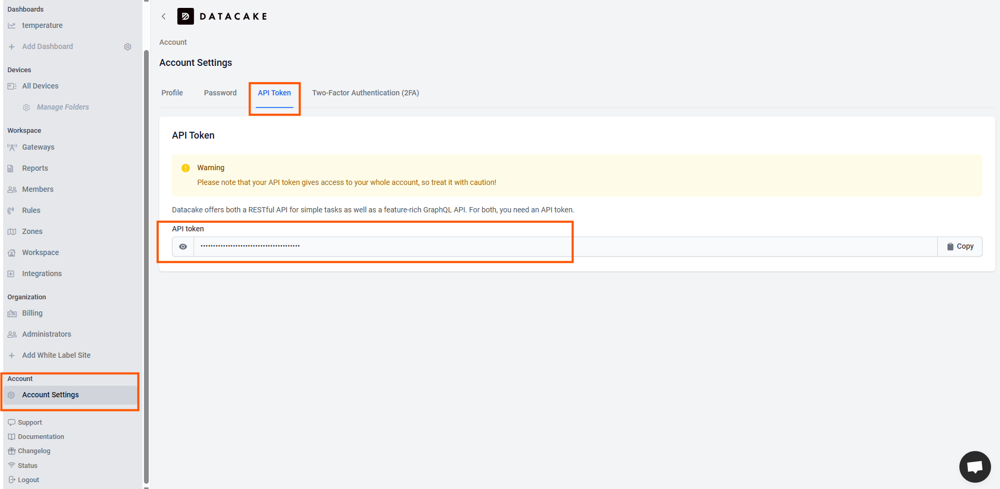

# How to connect the RN-320 BTH LoRaWAN Temperature and Humidity sensor to the Data Cake?

The Radionode RN320 series is a robust, battery-operated wireless environmental sensor, professionally engineered for durability and extreme longevity, boasting an unbelievable 10-year battery life (RN320-BTH model with 17,000mAh) facilitated by LoRaWAN technology for easy, wide-range network setup. This specific RN320-BTH model excels with an embedded high-accuracy temperature and humidity sensor, critical data protection via a retransmission function that prevents sample drops, and permanent local storage on a microSD card. User interaction is enhanced by an E-paper display, loud buzzer, and LED indicator, while quick access to comprehensive remote monitoring is ensured by simple QR code registration to the Radionode365 service.

---

### Features of RN-320 BTH Device

*   Long Range Wireless / LoraWAN ®
*   High Accuracy Temperature & Humidity Sensor
*   E-Paper Display
*   Loud Buzzer 97dBA
*   3 Color LED Indicator (Best, Moderate, Bad)
*   Long Battery Life (17000mAh)
*   MicroSD Card supported
*   Easy Installation with Magnet and Wall Bracket

---

### Prerequisites

To continue with this guide we will need the following:

*   RN320-BTH Temperature & Humidity Cloud Data Logger
*   LoRaWAN® gateway (in our case Radionode LoRaWAN Gateway)
*   Configured integration on networks server
*   Network Server account (The Things Stack)
*   Data Cake Account

---

### Device connection

##  The Things Stack Community setup

### Register Application

The first step is to register in the Things stack cloud console. Next create an application in TheThingsStack console. Go to the console, open Applications section, press the add application tab and then fill the application ID, application name and then create the application.


##  Payload Decoder

To ensure successful data transmission, both the device and the network server must be correctly configured.

Our device submits data in **binary format**. We have two options to decode the device data:

*   **TheThingsStack decoder:** Data will be decoded before entering the Thingsboard.
*   **Thingsboard converters:** Uplink/downlink converters will be used to decode data from binary format into JSON.

In this documentation, we will explain how you have to add the payload formatters in the **TTN platform (The Things Network/Stack)**.

1.  In the Application tab, navigate to **Payload formatters**.
2.  Click on the **Uplink** option.
3.  Copy and paste the payload formatter we have given below into the provided field.


```javascript
function decodeUplink(input) {
  const res = Decoder(input.bytes, input.fPort);
  if (res.error) {
    return { errors: [res.error] };
  }
  return { data: res };
}

function Decoder (bytes, port) {
  const readUInt8 = b => b & 0xFF;
  const readUInt16LE = b => (b[1] << 8) + b[0];
  const readInt16LE = b => {
    const ret = readUInt16LE(b);
    return (ret > 0x7FFF) ? ret - 0x10000 : ret;
  };
  const readUInt32LE = b => (b[3] << 24) + (b[2] << 16) + (b[1] << 8) + b[0];
  const readInt32LE = b => {
    const ret = readUInt32LE(b);
    return (ret > 0x7FFFFFFF) ? ret - 0x100000000 : ret;
  };
  const readFloatLE = b => {
    const buf = new ArrayBuffer(4);
    const view = new DataView(buf);
    for (let i = 0; i < 4; i++) view.setUint8(i, b[i]);
    return view.getFloat32(0, true); // ieee754 float
  };

  const head = readUInt8(bytes[0]);
  const model = readUInt8(bytes[1]);

  if (head === 11) {
    // Check-in frame
    const timestamp = readUInt32LE(bytes.slice(2, 6));
    const date = new Date(timestamp * 1000);
    const yyyy = date.getUTCFullYear();
    const mm = (date.getUTCMonth() + 1).toString().padStart(2, '0');
    const dd = date.getUTCDate().toString().padStart(2, '0');
    const verFormatted = parseInt(`${yyyy}${mm}${dd}`);
    const interval = readUInt16LE(bytes.slice(6, 8));
    const splrate = interval;
    const bat = readUInt8(bytes[8]);
    const millivolt = readUInt16LE(bytes.slice(9, 11));
    const volt = (millivolt / 1000).toFixed(3);
    const freqband = readUInt8(bytes[11]);
    const subband = readUInt8(bytes[12]);

    return {
      head,
      ver: verFormatted,
      interval,
      splrate,
      bat,
      volt,
      freqband,
      subband
    };
  }
  else if (head === 12 || head === 13) {
    // Sensor / Hold
    const tsmode = readUInt8(bytes[2]);
    const timestamp = readUInt32LE(bytes.slice(3, 7));
    const splfmt = readUInt8(bytes[7]);
    
    if (splfmt !== 2) {
      return { error: "Unsupported Sensor Data Format: " + splfmt };
    }

    const raw_size = 4;
    const data = bytes.slice(8);
    const ch_count = data.length / raw_size;
    const data_size = data.length;
    let offset = 0;
    let temperature = null, humidity = null;

    if (ch_count < 2) {
      return { error: "Unsupported Sensor Data Size:" + ch_count };
    }

    temperature = parseFloat(readFloatLE(data.slice(offset, offset + raw_size)).toFixed(2));
    if (temperature <= -9999.0) temperature = null;
    offset += raw_size;

    humidity = parseFloat(readFloatLE(data.slice(offset, offset + raw_size)).toFixed(2));
    if (humidity <= -9999.0) humidity = null;

    return {
      head,
      model,
      tsmode,
      timestamp,
      splfmt,
      data_size,
      temperature,
      humidity
    };
  }

  return { error: "Unsupported head frame: " + head };
}
```


##  Registering the End Device

To register the end device, follow the steps below and enter the necessary details (as you would see them in the accompanying image):

1.  **Input Method:** Select the end device in the **LoRaWAN Device repository**.
    > **Note:** Radionode devices are already registered in The Things Stack platform for easy selection.
2.  **End Device Brand:** Choose the option `Dekist Co.Ltd`.
3.  **Model:** You can choose among the available **Radionode LoRaWAN models**.
4.  **Cluster Selection:** Choose the cluster where the device can be added.


##  Finalizing Device Registration

1.  Next, you need to enter the **DevEUI** correctly in the slot provided. You can find the **DevEUI** printed on the sticker located on the side of the physical device.
2.  After entering the **DevEUI**, add a unique **End Device ID** in the given slot.
3.  Once both are entered, complete the end device registration.


##  DataCake Setup

After logging in to the **DataCake** platform, follow these steps:

1.  Click the **All devices** Tab.
2.  Press the **Add Device** button.
3.  You will see many options to connect to different networks.
4.  Here we will choose the **LoRaWAN** network.



###  Creating a New Device

1.  After choosing the **LoRaWAN** option, click the option **“New product”**.
2.  Give a descriptive name to your device.
3.  Click **Create** (or similar button) to finish creating the new device.



###  Choosing the LoRaWAN Network Server (LNS)

1.  Next, you need to choose the option for the **LoRaWAN Network Server (LNS)**.
2.  Here, we will be choosing the **“The Things Stack”** option.
3.  Press the **Next** button to continue.




###  Device Configuration Details

Next, you will be prompted to input the following required details:

*   **DeviceEUI**
*   **Name**
*   **Location** (optional, if needed)
*   **Tag** (optional, if needed)

Input these values into the fields prompted, as shown in the picture below:




###  Adding the Device to Datacake

After choosing the plan required for your application, you can now **add the device to the Datacake platform**.




###  Post-Creation Configuration

After the device is successfully created, follow these steps to access its configuration:

1.  Click the **"All Devices"** option.
2.  Click the **"Configuration"** tab.
3.  Navigate to **Product** and then **Hardware**.




###  Locating the Payload Decoder

In the **Configuration** tab, after selecting the **Product and Hardware** option, you will find a **Payload Decoder** option, as shown in the image below.

Copy and paste the code given below into the code block:



---

```javascript

function Decoder(payload, port) {
  function base64ToBytes(b64) {
    var chars = "ABCDEFGHIJKLMNOPQRSTUVWXYZabcdefghijklmnopqrstuvwxyz0123456789+/";
    var bytes = [], buffer = 0, bits = 0, i, val, c;
    for (i = 0; i < b64.length; i++) {
      c = b64.charAt(i);
      if (c === "=") break;
      val = chars.indexOf(c);
      if (val === -1) continue;
      buffer = (buffer << 6) | val;
      bits += 6;
      if (bits >= 8) {
        bits -= 8;
        bytes.push((buffer >> bits) & 0xFF);
      }
    }
    return bytes;
  }

  function bytesToUint32LE(b, p) {
    return (b[p] | (b[p + 1] << 8) | (b[p + 2] << 16) | (b[p + 3] << 24)) >>> 0;
  }

  function bytesToFloat32LE(b, p) {
    var bits = (b[p]) | (b[p + 1] << 8) | (b[p + 2] << 16) | (b[p + 3] << 24);
    var sign = (bits >>> 31) ? -1 : 1;
    var exp = (bits >>> 23) & 0xFF;
    var mant = bits & 0x7FFFFF;
    if (exp === 255) return mant ? NaN : sign * Infinity;
    if (exp === 0) return sign * Math.pow(2, -126) * (mant / Math.pow(2, 23));
    return sign * Math.pow(2, exp - 127) * (1 + mant / Math.pow(2, 23));
  }

  function rotateLeft(arr, start) {
    return arr.slice(start).concat(arr.slice(0, start));
  }

  var bytes = null;

  if (payload && payload.uplink_message) {
    if (payload.uplink_message.frm_payload)
      bytes = base64ToBytes(payload.uplink_message.frm_payload);
  } else if (payload && payload.b64payload) {
    bytes = base64ToBytes(payload.b64payload);
  } else if (payload instanceof Array) {
    bytes = payload.slice(0);
  } else if (typeof payload === "string") {
    bytes = base64ToBytes(payload);
  }

  if (!bytes) return [{ field: "ERROR", value: "No payload bytes found" }];

  // Find correct header (0x0C, 0x1E)
  var expectedHead = 0x0C, expectedModel = 0x1E, i, foundIndex = -1;
  for (i = 0; i < bytes.length - 1; i++) {
    if (bytes[i] === expectedHead && bytes[i + 1] === expectedModel) {
      foundIndex = i;
      break;
    }
  }
  if (foundIndex > 0) bytes = rotateLeft(bytes, foundIndex);

  var head = bytes[0] || 0;
  var model = bytes[1] || 0;
  var tsmode = bytes[2] || 0;
  var timestamp = bytesToUint32LE(bytes, 3);
  var splfmt = bytes[7] || 0;
  var data_size = bytes.length - 8;

  var temperature = null, humidity = null;
  if (splfmt === 2 && bytes.length >= 16) {
    temperature = bytesToFloat32LE(bytes, 8);
    humidity = bytesToFloat32LE(bytes, 12);
  }

  var result = [];
  result.push({ field: "MY_FIELD", value: head });
  result.push({ field: "MY_FIELD", value: model });
  result.push({ field: "TSMODE", value: tsmode });
  result.push({ field: "TIMESTAMP", value: timestamp });
  result.push({ field: "SPLFMT", value: splfmt });
  result.push({ field: "DATA_SIZE", value: data_size });
  if (temperature !== null) result.push({ field: "TEMPERATURE", value: temperature.toFixed(2) });
  if (humidity !== null) result.push({ field: "HUMIDITY", value: humidity.toFixed(2) });

  return result;
}
```

###  Retrieving the API Token

After creating the device and setting up the payload decoder, the next step is to obtain the **API Token** necessary for creating the webhook in the TTN platform.

1.  Navigate to the **Account Settings** tab.
2.  Click on **API Token**.
3.  Copy the token displayed here, as shown in the image below.





## Creating a Webhook in The Things Stack (TTN)

Now, within The Things Stack (TTN) platform, follow these steps to create the webhook:

1.  Click the **Webhooks** option.
2.  Click the **Add webhook** option.
3.  Choose the **Data Cake** option from the list of integrations.

.
2.  **Paste the token** you previously copied from the Data Cake platform into the designated field.
3.  Click **Create Webhook** (or the corresponding button) to finalize the setup.

 gateway, communication begins, and **data is successfully sent to the Data Cake platform**.

However, we need to perform one final configuration step within Data Cake to enable dashboard monitoring:

1.  Navigate to the **Devices** tab in the Data Cake platform.
2.  Click the **Configuration** tab.
3.  Select the **Field** option.
4.  In this section, you will see all the raw data fields being received from your sensor.
5.  **Choose the specific fields** you would like to store and ultimately visualize on your dashboard.

   , follow these instructions to view your data:

1.  Click the **Dashboard** tab within the Device options.
2.  You can now **visualize the incoming data** from your sensor on the dashboard.

   ![The Things Stack Community Edition Sign-in Screen](images/datacake/dc_Lora_18.png
