# RN-320 BTH LoRaWAN Sensor Integration Guide with Losant
## Introduction

This guide explains how to connect the **RN-320 BTH LoRaWAN Temperature and Humidity sensor** to the **Losant** platform.

The **Radionode RN320 series** is a robust, battery-operated wireless environmental sensor, professionally engineered for durability and extreme longevity, boasting an unbelievable **10-year battery life** (RN320-BTH model with 17,000mAh) facilitated by LoRaWAN technology for easy, wide-range network setup.

This specific RN320-BTH model excels with an **embedded high-accuracy temperature and humidity sensor**, critical data protection via a retransmission function that prevents sample drops, and permanent local storage on a **microSD card**. User interaction is enhanced by an **E-paper display**, **loud buzzer (97dBA)**, and a **3-Color LED indicator** (Best, Moderate, Bad), while quick access to comprehensive remote monitoring is ensured by simple QR code registration to the Radionode365 service. It also offers easy installation with a magnet and wall bracket.

---

## Prerequisites

To continue with this guide, you will need the following:

* **RN320-BTH** Temperature & Humidity Cloud Data Logger
* **LoRaWAN® gateway** (e.g., Radionode LoRaWAN Gateway)
* Configured integration on a networks server and ThingsBoard
* **Network Server account** (The Things Stack)
* **Losant account** 

---

## Device Connection: The Things Stack Community Setup

### Register Application

The first step is to register in the **The Things Stack** cloud console. Next, create an application in The Things Stack console.

1.  Go to the console and open the **Applications** section.
    
2.  Press the **Add application** tab and then fill in the **Application ID** and **Application Name**.
3.  Click **Create application**.
    

### Payload Decoder

To ensure successful data transmission, both the device and the network server must be correctly configured. Our device submits data in **binary format**.

In this documentation, we explain how to add the payload formatters in the TTN platform.

1.  In the application tab, click on **Payload formatters** and select the **Uplink** option.
2.  Copy and paste the payload formatter code below into the editor.
    

```javascript
function decodeUplink(input) {
  const res = Decoder(input.bytes, input.fPort);
  if (res.error) {
    return { errors: [res.error] };
  }
  return { data: res };
}

function Decoder (bytes, port) {
  const readUInt8 = b => b & 0xFF;
  const readUInt16LE = b => (b[1] << 8) + b[0];
  const readInt16LE = b => {
    const ret = readUInt16LE(b);
    return (ret > 0x7FFF) ? ret - 0x10000 : ret;
  };
  const readUInt32LE = b => (b[3] << 24) + (b[2] << 16) + (b[1] << 8) + b[0];
  const readInt32LE = b => {
    const ret = readUInt32LE(b);
    return (ret > 0x7FFFFFFF) ? ret - 0x100000000 : ret;
  };
  const readFloatLE = b => {
    const buf = new ArrayBuffer(4);
    const view = new DataView(buf);
    for (let i = 0; i < 4; i++) view.setUint8(i, b[i]);
    return view.getFloat32(0, true); // ieee754 float
  };

  const head = readUInt8(bytes[0]);
  const model = readUInt8(bytes[1]);

  if (head === 11) {
    // Check-in frame
    const timestamp = readUInt32LE(bytes.slice(2, 6));
    const date = new Date(timestamp * 1000);
    const yyyy = date.getUTCFullYear();
    const mm = (date.getUTCMonth() + 1).toString().padStart(2, '0');
    const dd = date.getUTCDate().toString().padStart(2, '0');
    const verFormatted = parseInt(`${yyyy}${mm}${dd}`);
    const interval = readUInt16LE(bytes.slice(6, 8));
    const splrate = interval;
    const bat = readUInt8(bytes[8]);
    const millivolt = readUInt16LE(bytes.slice(9, 11));
    const volt = (millivolt / 1000).toFixed(3);
    const freqband = readUInt8(bytes[11]);
    const subband = readUInt8(bytes[12]);

    return {
      head,
      ver: verFormatted,
      interval,
      splrate,
      bat,
      volt,
      freqband,
      subband
    };
  }
  else if (head === 12 || head === 13) {
    // Sensor / Hold
    const tsmode = readUInt8(bytes[2]);
    const timestamp = readUInt32LE(bytes.slice(3, 7));
    const splfmt = readUInt8(bytes[7]);
    
    if (splfmt !== 2) {
      return { error: "Unsupported Sensor Data Format: " + splfmt };
    }

    const raw_size = 4;
    const data = bytes.slice(8);
    const ch_count = data.length / raw_size;
    const data_size = data.length;
    let offset = 0;
    let temperature = null, humidity = null;

    if (ch_count < 2) {
      return { error: "Unsupported Sensor Data Size:" + ch_count };
    }

    temperature = parseFloat(readFloatLE(data.slice(offset, offset + raw_size)).toFixed(2));
    if (temperature <= -9999.0) temperature = null;
    offset += raw_size;

    humidity = parseFloat(readFloatLE(data.slice(offset, offset + raw_size)).toFixed(2));
    if (humidity <= -9999.0) humidity = null;

    return {
      head,
      model,
      tsmode,
      timestamp,
      splfmt,
      data_size,
      temperature,
      humidity
    };
  }

  return { error: "Unsupported head frame: " + head };
}
```
###  End Device Registration Details

To register the **End Device**, enter these details:

*   **Input Method:** Select the end device in the **LoRaWAN Device repository** (Radionode devices are already registered in the Thing Stack platform).
*   **End Device Brand:** Choose this option (**Dekist Co.Ltd**).
*   **Model:** You can choose among the **Radionode LoRaWAN models**.
*   **Cluster:** Choose the cluster where the device can be added.
*   
   

 

 ###  Finalizing End Device Registration

1.  Next, you need to enter the **DevEUI** correctly in the slot provided. You can find the **DevEUI** on the sticker on the side of the device.
2.  After this, add an **End Device ID** in the given slot.
3.  Click the button to **complete the end device registration**.


###  Losant Setup

After logging in to the **Losant platform**:

1.  Click the **Webhook** tab.
2.  Click the **Add Webhook** button.

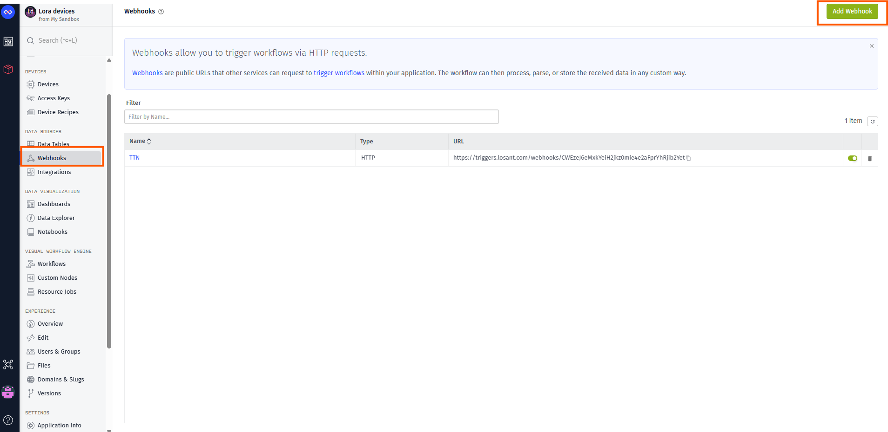

###  Webhook Configuration

1.  Next, choose the type of **webhook** you want to create to enable communication from **TTN** (The Things Network).
2.  You should choose the **HTTP** option.

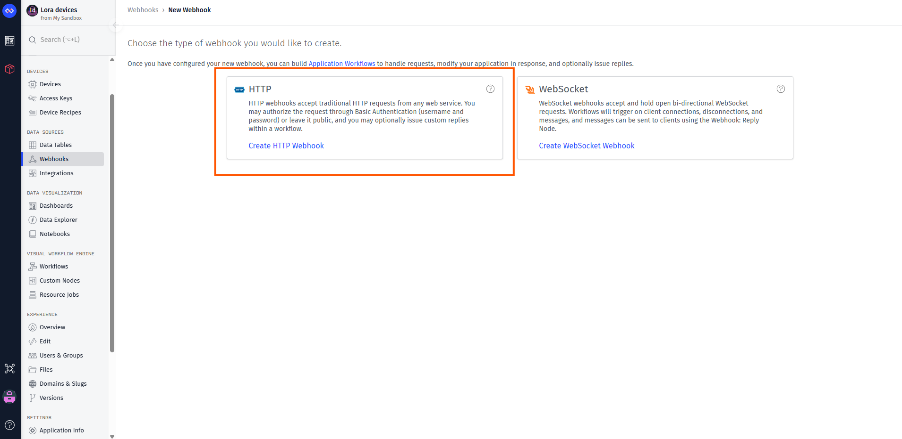

Next give a name to the Webhook and Create the webhook as shown in the figure below.

 

###  Copy Webhook URL

After creating the webhook:

1.  **Copy the URL** (as shown in the image below).
2.  You'll need to use this copied URL when creating the Webhook in the **TTN (The Things Network) platform**.

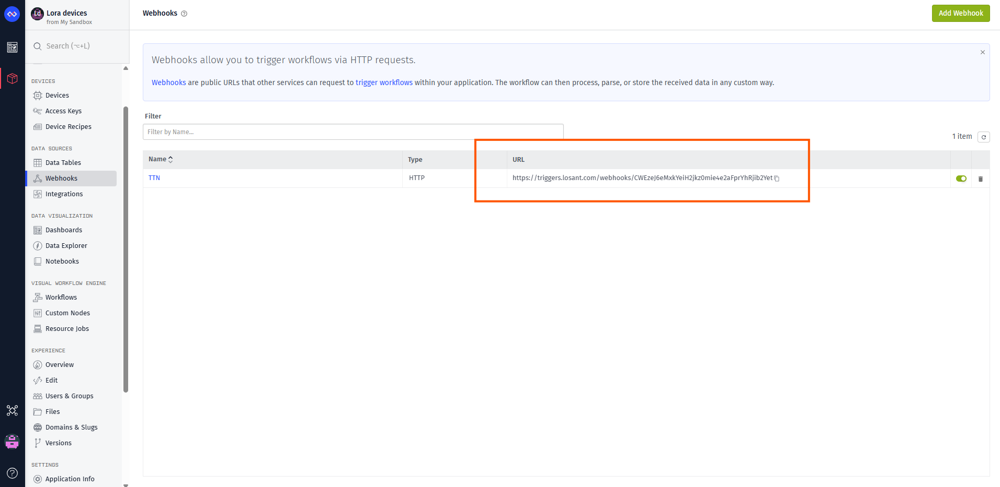

##  TTN Webhook Configuration

1.  **Log in** to the **TTN Console** and select the target **Application**.
2.  Navigate to **Integrations** → **Webhooks**.
3.  Click **Add Webhooks** (as shown in the figure below).

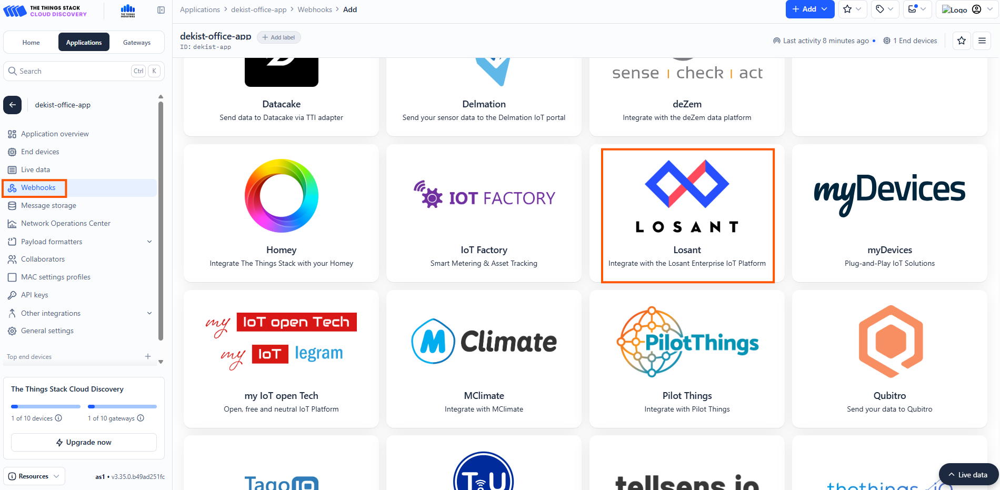

###  Creating the Webhook

1.  Add a **Name** for the Webhook ID.
2.  Paste the **copied URL** (from the Losant platform) into the webhook template in the TTN platform.
3.  Click **Create Webhook** to enable the integration.

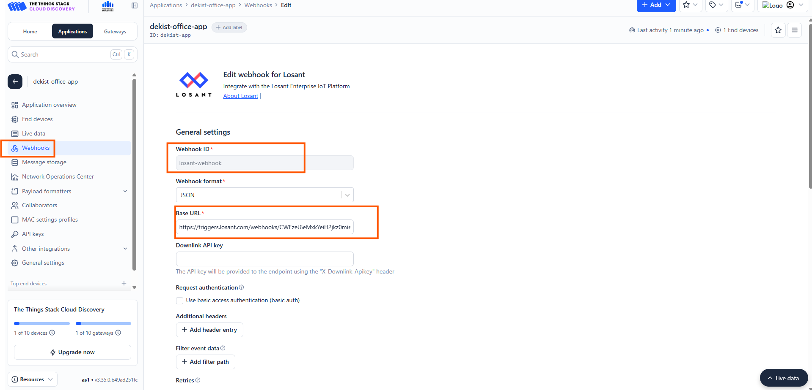

##  Creating a Workflow in the Losant Platform

The next step is to create a workflow in the Losant platform to process the incoming data.

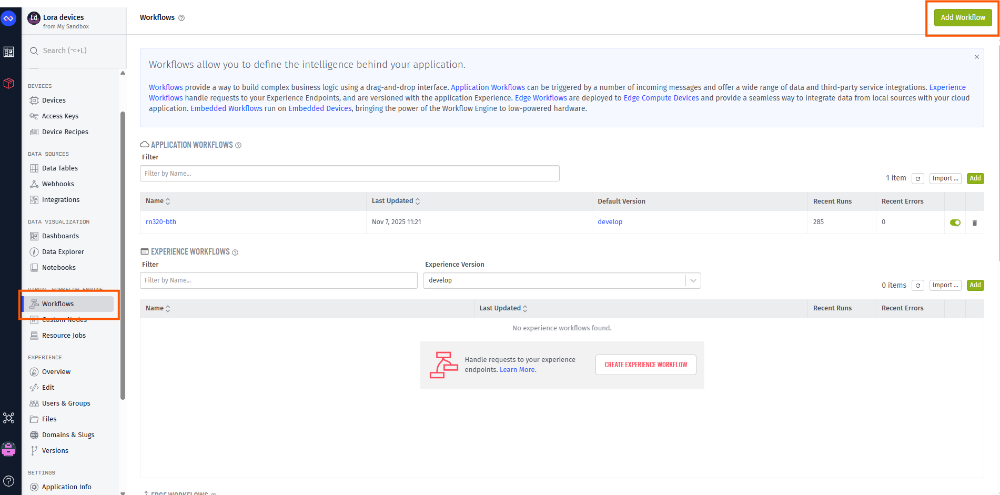

In the workflow name, give a unique name for your workflow and Click create workflow button.

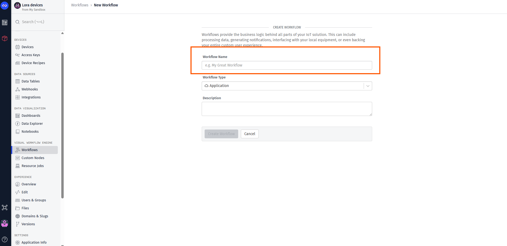

Exactly drag and drop the blocks as shown in the figure to create the workflow and then copy the workflow ID as shown in the figure.

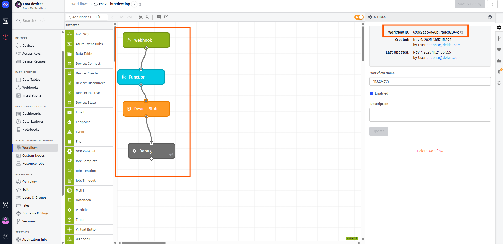

###  Adding a Device

1.  Navigate to the **Devices** tab.
2.  Click the **Add device** button.
3.  You will see a screen similar to the one below. Select the **Standalone** option.

  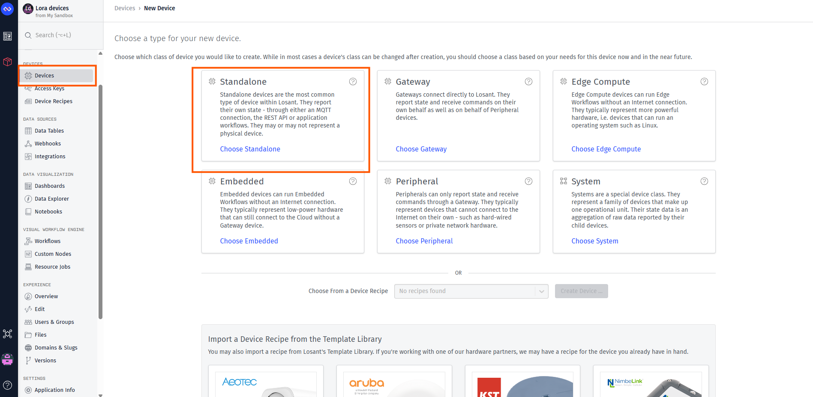  

###  Configuring Device Details

On the device details page:

*   **Device ID:** Paste the ID you copied from the workflow template into the **Device ID** field.
*   **Name & Description:** Add a name and description of your choice, as shown in the figure below.

    

    ###  Selecting Device Keys

On the device page:

1.  Set the **Device Class** to `Standalone`.
2.  Choose the **Key values** from your sensor.
3.  Select the following as Keys and their respective values:
    *   `temperature`
    *   `humidity`
    *   `timestamp`

   

   ###  Adding Device Attributes

1.  Navigate to the **Attributes** tab on the device page.
2.  Click the **Add** button.
3.  Add all the necessary attributes you require from the sensor.

> **Note:** Once communication is enabled, you can view the device log on the right side of the page.

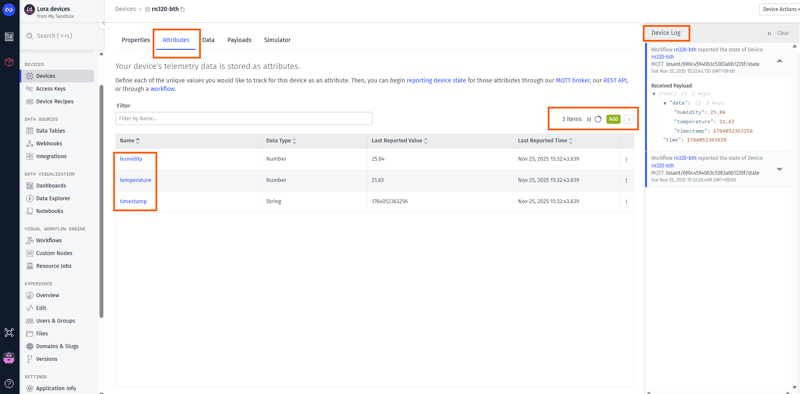


For visualizing the Dashboard, you can go to the Dashboard page and Add a Dashboard.

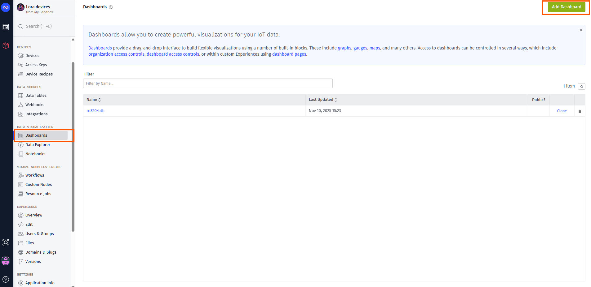

Give the Dashboard a name and create the dashboard.


Add your desired blocks and create the Dashboard based on your needs.

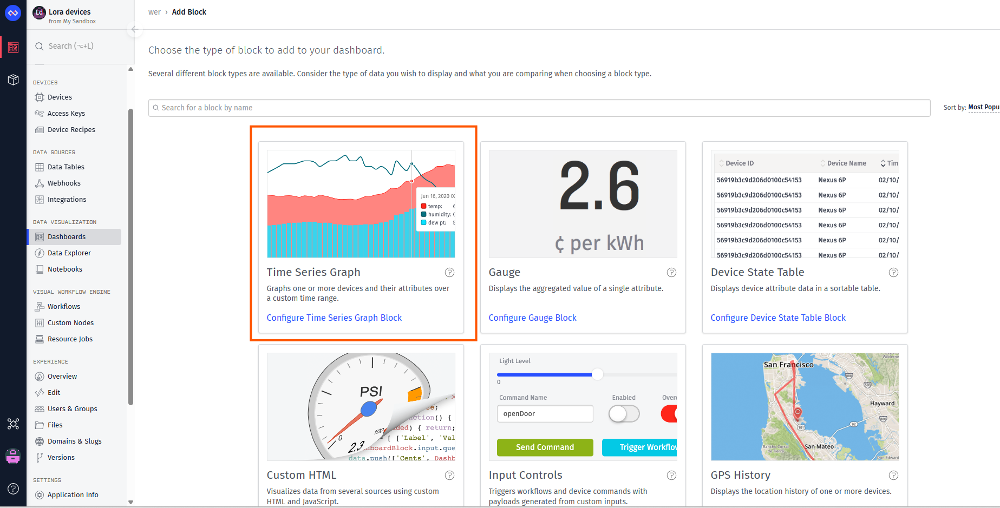

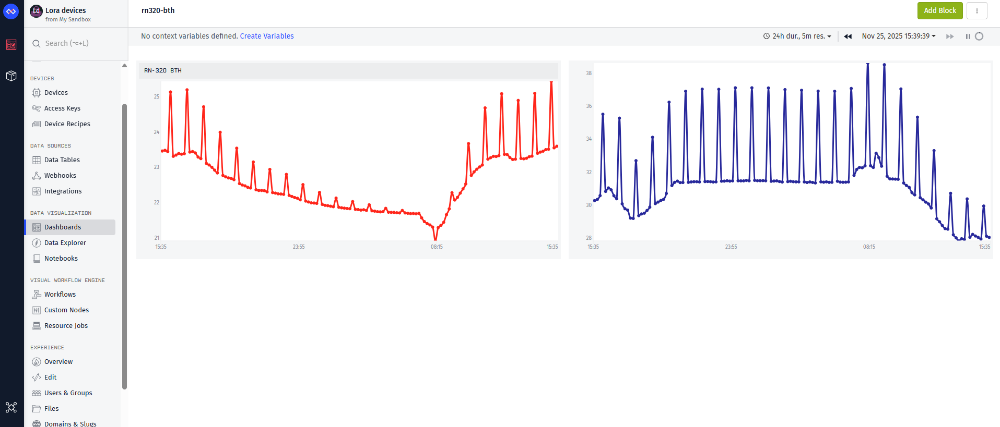

    

