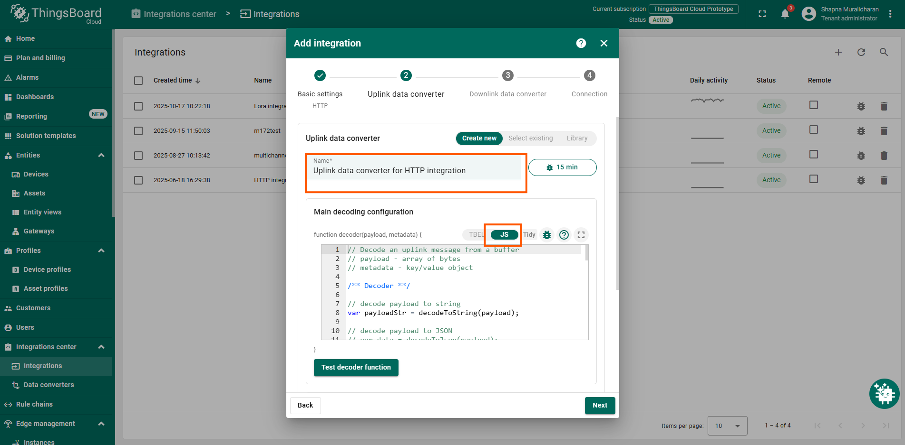

# RN-320 BTH LoRaWAN Sensor Integration Guide with ThingsBoard

## Introduction

This guide explains how to connect the **RN-320 BTH LoRaWAN Temperature and Humidity sensor** to the **ThingsBoard** platform.

The **Radionode RN320 series** is a robust, battery-operated wireless environmental sensor, professionally engineered for durability and extreme longevity, boasting an unbelievable **10-year battery life** (RN320-BTH model with 17,000mAh) facilitated by LoRaWAN technology for easy, wide-range network setup.

This specific RN320-BTH model excels with an **embedded high-accuracy temperature and humidity sensor**, critical data protection via a retransmission function that prevents sample drops, and permanent local storage on a **microSD card**. User interaction is enhanced by an **E-paper display**, **loud buzzer (97dBA)**, and a **3-Color LED indicator** (Best, Moderate, Bad), while quick access to comprehensive remote monitoring is ensured by simple QR code registration to the Radionode365 service. It also offers easy installation with a magnet and wall bracket.

---

## Prerequisites

To continue with this guide, you will need the following:

* **RN320-BTH** Temperature & Humidity Cloud Data Logger
* **LoRaWAN® gateway** (e.g., Radionode LoRaWAN Gateway)
* Configured integration on a networks server and ThingsBoard
* **Network Server account** (The Things Stack)
* **ThingsBoard account** (PE account)

---

## Device Connection: The Things Stack Community Setup

### Register Application

The first step is to register in the **The Things Stack** cloud console. Next, create an application in The Things Stack console.

1.  Go to the console and open the **Applications** section.
    
2.  Press the **Add application** tab and then fill in the **Application ID** and **Application Name**.
3.  Click **Create application**.
    

### Payload Decoder

To ensure successful data transmission, both the device and the network server must be correctly configured. Our device submits data in **binary format**.

In this documentation, we explain how to add the payload formatters in the TTN platform.

1.  In the application tab, click on **Payload formatters** and select the **Uplink** option.
2.  Copy and paste the payload formatter code below into the editor.
    

```javascript
function decodeUplink(input) {
  const res = Decoder(input.bytes, input.fPort);
  if (res.error) {
    return { errors: [res.error] };
  }
  return { data: res };
}

function Decoder (bytes, port) {
  const readUInt8 = b => b & 0xFF;
  const readUInt16LE = b => (b[1] << 8) + b[0];
  const readInt16LE = b => {
    const ret = readUInt16LE(b);
    return (ret > 0x7FFF) ? ret - 0x10000 : ret;
  };
  const readUInt32LE = b => (b[3] << 24) + (b[2] << 16) + (b[1] << 8) + b[0];
  const readInt32LE = b => {
    const ret = readUInt32LE(b);
    return (ret > 0x7FFFFFFF) ? ret - 0x100000000 : ret;
  };
  const readFloatLE = b => {
    const buf = new ArrayBuffer(4);
    const view = new DataView(buf);
    for (let i = 0; i < 4; i++) view.setUint8(i, b[i]);
    return view.getFloat32(0, true); // ieee754 float
  };

  const head = readUInt8(bytes[0]);
  const model = readUInt8(bytes[1]);

  if (head === 11) {
    // Check-in frame
    const timestamp = readUInt32LE(bytes.slice(2, 6));
    const date = new Date(timestamp * 1000);
    const yyyy = date.getUTCFullYear();
    const mm = (date.getUTCMonth() + 1).toString().padStart(2, '0');
    const dd = date.getUTCDate().toString().padStart(2, '0');
    const verFormatted = parseInt(`${yyyy}${mm}${dd}`);
    const interval = readUInt16LE(bytes.slice(6, 8));
    const splrate = interval;
    const bat = readUInt8(bytes[8]);
    const millivolt = readUInt16LE(bytes.slice(9, 11));
    const volt = (millivolt / 1000).toFixed(3);
    const freqband = readUInt8(bytes[11]);
    const subband = readUInt8(bytes[12]);

    return {
      head,
      ver: verFormatted,
      interval,
      splrate,
      bat,
      volt,
      freqband,
      subband
    };
  }
  else if (head === 12 || head === 13) {
    // Sensor / Hold
    const tsmode = readUInt8(bytes[2]);
    const timestamp = readUInt32LE(bytes.slice(3, 7));
    const splfmt = readUInt8(bytes[7]);
    
    if (splfmt !== 2) {
      return { error: "Unsupported Sensor Data Format: " + splfmt };
    }

    const raw_size = 4;
    const data = bytes.slice(8);
    const ch_count = data.length / raw_size;
    const data_size = data.length;
    let offset = 0;
    let temperature = null, humidity = null;

    if (ch_count < 2) {
      return { error: "Unsupported Sensor Data Size:" + ch_count };
    }

    temperature = parseFloat(readFloatLE(data.slice(offset, offset + raw_size)).toFixed(2));
    if (temperature <= -9999.0) temperature = null;
    offset += raw_size;

    humidity = parseFloat(readFloatLE(data.slice(offset, offset + raw_size)).toFixed(2));
    if (humidity <= -9999.0) humidity = null;

    return {
      head,
      model,
      tsmode,
      timestamp,
      splfmt,
      data_size,
      temperature,
      humidity
    };
  }

  return { error: "Unsupported head frame: " + head };
}
```
## End Device Registration in The Things Stack

Next step is an **End Device creation** in the TTS. Open the **Devices** page and click the **Register device** tab.


To register the End Device, enter the following details:

* **Input Method**: Select the end device in the LoRaWAN Device repository (Radionode devices are already registered in the Thing Stack platform).
* **End Device Brand**: Choose the option **Dekist Co.Ltd**.
* **Model**: Choose among the Radionode LoRaWAN models.
* Choose the appropriate **cluster** where the device can be added.


Next, we need to enter the **DevEUI** correctly in the slot provided there. You can find the **DevEUI** on the sticker on the side of the device.

After this, add an **End Device ID** in the slot given and complete the end device registration by clicking **Register end device**.


## ThingsBoard Setup

1.  Register an account in the **ThingsBoard** platform.
2.  In the **Integrations** tab, start a **new integration**.
3.  In the integration type option, select the **HTTP** option, as we will be receiving data from the webhooks created in TTS.
4.  Then, add a **name** for the integration.


Then press the **Next** button. You need to add a name for your integration and toggle to the **JS** button in the decoder options, as shown in the figure below.



In the payload decoder for the message received from the network server, copy and paste the following JavaScript code:

```javascript
function safeParse(payload) {
  try {
    if (typeof payload === 'string') {
      return JSON.parse(payload);
    } else if (Array.isArray(payload)) {
      // If payload is byte array (common in ThingsBoard tests)
      var text = String.fromCharCode.apply(null, payload);
      return JSON.parse(text);
    } else if (typeof payload === 'object' && payload !== null) {
      return payload;
    }
  } catch (e) {
    return {};
  }
  return {};
}

var data = safeParse(payload);

// Step 2: Extract decoded LoRaWAN data
var deviceName = data?.end_device_ids?.device_id || "Unknown_Device";
var applicationId = data?.end_device_ids?.application_ids?.application_id || "Unknown_App";
var decoded = data?.uplink_message?.decoded_payload || {};
var rx = (data?.uplink_message?.rx_metadata && data.uplink_message.rx_metadata[0]) || {};

// Step 3: Build telemetry
var telemetry = {};
if (decoded.temperature !== undefined) telemetry.temperature = decoded.temperature;
if (decoded.humidity !== undefined) telemetry.humidity = decoded.humidity;
if (decoded.model !== undefined) telemetry.model = decoded.model;
if (decoded.timestamp !== undefined) telemetry.timestamp = decoded.timestamp;
if (rx.rssi !== undefined) telemetry.rssi = rx.rssi;
if (rx.snr !== undefined) telemetry.snr = rx.snr;

// Step 4: Build final payload for ThingsBoard
var result = {
  deviceName: deviceName,
  deviceType: "RN320-BTH",
  telemetry: {
    ts: Date.parse(data?.uplink_message?.received_at || new Date().toISOString()),
    values: telemetry
  },
  attributes: {
    app_id: applicationId,
    f_port: data?.uplink_message?.f_port,
    frequency: data?.uplink_message?.settings?.frequency,
    spreading_factor: data?.uplink_message?.settings?.data_rate?.lora?.spreading_factor,
    gateway_id: rx?.gateway_ids?.gateway_id,
    dev_eui: data?.end_device_ids?.dev_eui
  }
};

return result;
```

