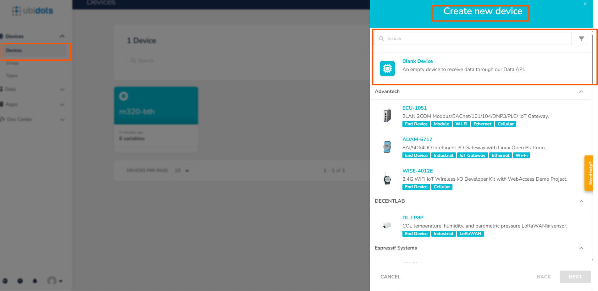
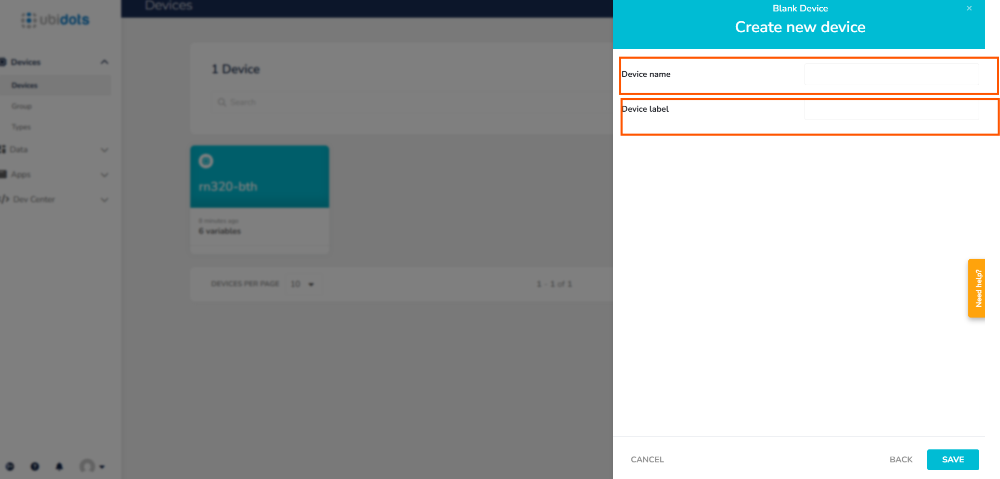
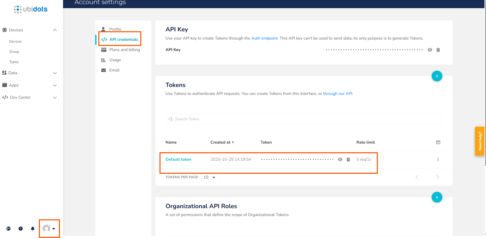
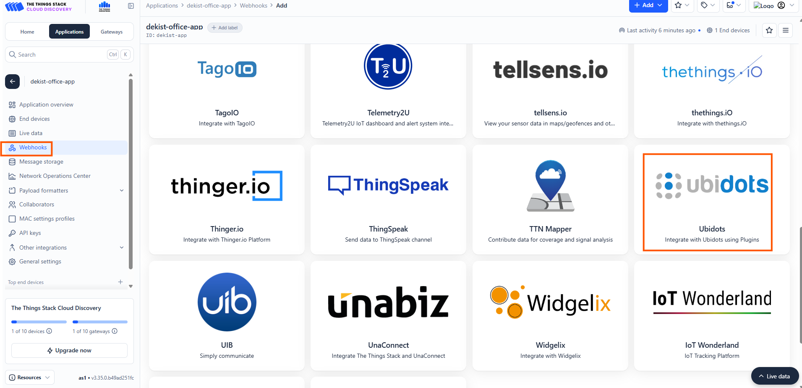
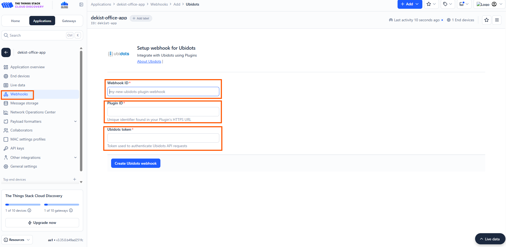
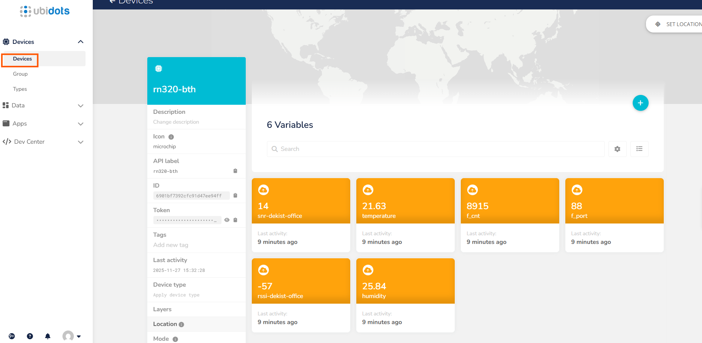
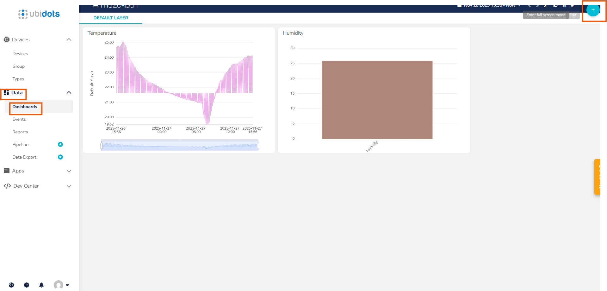

#  How to Connect the RN-320 BTH LoRaWAN Sensor to Ubidots

---

##  Device Overview: Radionode RN320-BTH

The Radionode RN320 series is a robust, battery-operated wireless environmental sensor, professionally engineered for durability and extreme longevity, boasting an unbelievable **10-year battery life** (RN320-BTH model with 17,000mAh) facilitated by LoRaWAN technology for easy, wide-range network setup.

This specific RN320-BTH model:

*   Excels with an embedded **high-accuracy temperature and humidity sensor**.
*   Offers critical data protection via a retransmission function that prevents sample drops.
*   Includes permanent local storage on a **microSD card**.
*   Provides enhanced user interaction via an E-paper display, loud buzzer, and LED indicator.
*   Ensures quick access to comprehensive remote monitoring by simple QR code registration to the Radionode365 service.

##  Features of RN-320 BTH Device

*   **Long Range Wireless / LoRaWAN®**
*   High Accuracy Temperature & Humidity Sensor
*   E-Paper Display
*   Loud Buzzer (97dBA)
*   3 Color LED Indicator (Best, Moderate, Bad)
*   Long Battery Life (17000mAh)
*   MicroSD Card supported
*   Easy Installation with Magnet and Wall Bracket

##  Prerequisites

To continue with this guide, you will need the following:

*   RN320-BTH Temperature & Humidity Cloud Data Logger
*   LoRaWAN® gateway (in our case, the Radionode LoRaWAN Gateway)
*   Configured integration on network server
*   Network Server account (**The Things Stack**)
*   Ubidots Account

---

##  Device Connection & Setup

### 1. The Things Stack Community Setup

### 2. Register Application

The first step is to register in The Things Stack cloud console. Next, you will create an application.

**Steps to Create an Application:**

1.  Go to **The Things Stack console**.
2.  Open the **Applications** section.
3.  Press the **Add application** tab.
4.  Fill in the necessary **Application ID** and **Application Name**.
5.  **Create** the application.


##  Payload Decoder Setup

To ensure successful data transmission, both the device and the network server must be correctly configured. Our device submits data in **binary format**, which requires decoding.

We have two options for decoding the device data:

*   **The Things Stack Decoder:** Data will be decoded *before* entering Ubidots/Thingsboard (assuming Ubidots is the final platform).
*   **Thingsboard Converters:** Uplink/downlink converters will be used to decode data from binary format into JSON within the Thingsboard platform (if used as an intermediary).

### 1. Implementing the Payload Formatter in The Things Stack (Recommended)

In this documentation, we will explain how to add the payload formatters directly in The Things Stack (TTS) platform.

**Steps:**

1.  In your Application tab within the TTS console, locate and click the **Payload formatters** section.
2.  Select the **Uplink** option.
3.  Copy and paste the required payload formatter code (which should be provided below) into the editor.


```javascript
function decodeUplink(input) {
  const res = Decoder(input.bytes, input.fPort);
  if (res.error) {
    return { errors: [res.error] };
  }
  return { data: res };
}

function Decoder (bytes, port) {
  const readUInt8 = b => b & 0xFF;
  const readUInt16LE = b => (b[1] << 8) + b[0];
  const readInt16LE = b => {
    const ret = readUInt16LE(b);
    return (ret > 0x7FFF) ? ret - 0x10000 : ret;
  };
  const readUInt32LE = b => (b[3] << 24) + (b[2] << 16) + (b[1] << 8) + b[0];
  const readInt32LE = b => {
    const ret = readUInt32LE(b);
    return (ret > 0x7FFFFFFF) ? ret - 0x100000000 : ret;
  };
  const readFloatLE = b => {
    const buf = new ArrayBuffer(4);
    const view = new DataView(buf);
    for (let i = 0; i < 4; i++) view.setUint8(i, b[i]);
    return view.getFloat32(0, true); // ieee754 float
  };

  const head = readUInt8(bytes[0]);
  const model = readUInt8(bytes[1]);

  if (head === 11) {
    // Check-in frame
    const timestamp = readUInt32LE(bytes.slice(2, 6));
    const date = new Date(timestamp * 1000);
    const yyyy = date.getUTCFullYear();
    const mm = (date.getUTCMonth() + 1).toString().padStart(2, '0');
    const dd = date.getUTCDate().toString().padStart(2, '0');
    const verFormatted = parseInt(`${yyyy}${mm}${dd}`);
    const interval = readUInt16LE(bytes.slice(6, 8));
    const splrate = interval;
    const bat = readUInt8(bytes[8]);
    const millivolt = readUInt16LE(bytes.slice(9, 11));
    const volt = (millivolt / 1000).toFixed(3);
    const freqband = readUInt8(bytes[11]);
    const subband = readUInt8(bytes[12]);

    return {
      head,
      ver: verFormatted,
      interval,
      splrate,
      bat,
      volt,
      freqband,
      subband
    };
  }
  else if (head === 12 || head === 13) {
    // Sensor / Hold
    const tsmode = readUInt8(bytes[2]);
    const timestamp = readUInt32LE(bytes.slice(3, 7));
    const splfmt = readUInt8(bytes[7]);
    
    if (splfmt !== 2) {
      return { error: "Unsupported Sensor Data Format: " + splfmt };
    }

    const raw_size = 4;
    const data = bytes.slice(8);
    const ch_count = data.length / raw_size;
    const data_size = data.length;
    let offset = 0;
    let temperature = null, humidity = null;

    if (ch_count < 2) {
      return { error: "Unsupported Sensor Data Size:" + ch_count };
    }

    temperature = parseFloat(readFloatLE(data.slice(offset, offset + raw_size)).toFixed(2));
    if (temperature <= -9999.0) temperature = null;
    offset += raw_size;

    humidity = parseFloat(readFloatLE(data.slice(offset, offset + raw_size)).toFixed(2));
    if (humidity <= -9999.0) humidity = null;

    return {
      head,
      model,
      tsmode,
      timestamp,
      splfmt,
      data_size,
      temperature,
      humidity
    };
  }

  return { error: "Unsupported head frame: " + head };
}
```


##  Registering the End Device

To register the end device, follow the steps below and enter the necessary details (as you would see them in the accompanying image):

1.  **Input Method:** Select the end device in the **LoRaWAN Device repository**.
    > **Note:** Radionode devices are already registered in The Things Stack platform for easy selection.
2.  **End Device Brand:** Choose the option `Dekist Co.Ltd`.
3.  **Model:** You can choose among the available **Radionode LoRaWAN models**.
4.  **Cluster Selection:** Choose the cluster where the device can be added.


##  Finalizing Device Registration

1.  Next, you need to enter the **DevEUI** correctly in the slot provided. You can find the **DevEUI** printed on the sticker located on the side of the physical device.
2.  After entering the **DevEUI**, add a unique **End Device ID** in the given slot.
3.  Once both are entered, complete the end device registration.


##  Ubidots Setup

After successfully logging in to the Ubidots platform:

1.  Click the **Devices** option in the navigation menu.
2.  Create a new device by selecting the **Blank** device type.



###  Naming the New Device

1.  After selecting the **Blank device** option, you will need to provide a **Device name**.
2.  Also provide a corresponding **Device label**.
3.  Finally, click **Save** to complete the new device creation.




##  Webhook and Authorization Setup

The next critical step is creating the webhook within the **TTN (The Things Network)** platform. To achieve this, you first need to obtain the necessary **Authorization Token** from Ubidots.

###  Copying the Ubidots API Token

1.  Navigate to your Ubidots **Account Settings**.
2.  Look for the **API Credentials** option (or similar).
3.  Click on **API Credentials** to reveal your tokens.
4.  You will find a default token (usually labeled as the **Authorization Token**).
5.  **Copy and securely store this token**, as it will be required when configuring the webhook in the TTN platform.
6.  


##  Creating the Webhook in TTN Stack

Now that you have your Authorization Token, you can configure the webhook in The Things Network (TTN) platform:

1.  In the TTN Console for your application, click on the **Webhooks** option in the navigation menu.
2.  Click the **+ Add Webhook** button.
3.  Choose the **Ubidots** integration template from the list of options.





##  Completing the Webhook Details

To finalize the webhook creation in The Things Network (TTN) Console, you will need to input the required parameters:

1.  **Webhook ID:** Enter a unique and descriptive identifier for this webhook (e.g., `ubidots-integration`).
2.  **Plugin ID:** Enter the specific Ubidots Plugin ID (this may be pre-filled or need to be entered based on the region/setup).
3.  **Authorization Token:** Paste the **Authorization Token** you previously copied from the Ubidots platform into the designated field.

After filling in these details, click **Create webhook** (or equivalent button) to establish the connection.




##  Verifying Data Flow

Once the webhook is successfully created and your device is actively connected to The Things Network (TTN) gateway:

*   Communication is established, and the sensor data begins to be forwarded automatically to the Ubidots platform.

To view the incoming data:

1.  Navigate to the **Devices** tab in your Ubidots account.
2.  Click on the specific device associated with your TTN application.




##  Creating a Data Dashboard

To visualize the incoming data, you need to create a dashboard in Ubidots:

1.  Navigate to the **Data** tab on the main menu.
2.  Select **Dashboards**.
3.  Click the **+** sign (or **Create Dashboard** button).
4.  Once the dashboard is created, click the **+** sign again to add widgets.
5.  Select from the different **widget options** (e.g., charts, gauges, indicators) to create a visualization of your data.


